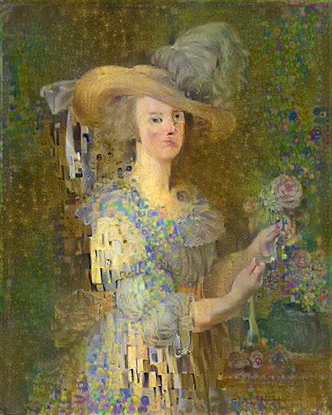

# Week 7 - Using Tensorflow to Create Outputs

#### What did I do?

I used the Neural Transfer with tf.keras Tutorial to create a deep dream generated image using two of my own images on Google Colab. The script is saved in the file titled ***DeepDream.ipynb*** and the output image is as shown below.
  

  

  

  
#### What did I learn?

I initially was slightly confused with how deep dream with tensorflow works during class. However, after working on it at home and carefully rereading the explanation on the tutorial website, I was able to better understand how the model is trained, how the output is generated and the modules used in this exercise. I don't think I would be able to write this script from scratch on my own, but now understand the basic underlying concepts.

#### How should the code run?

The code is in the file titled ***DeepDream.ipynb*** and should work in Google Colab.